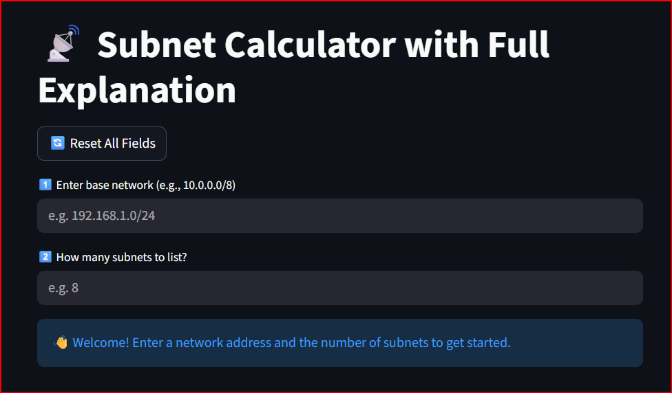
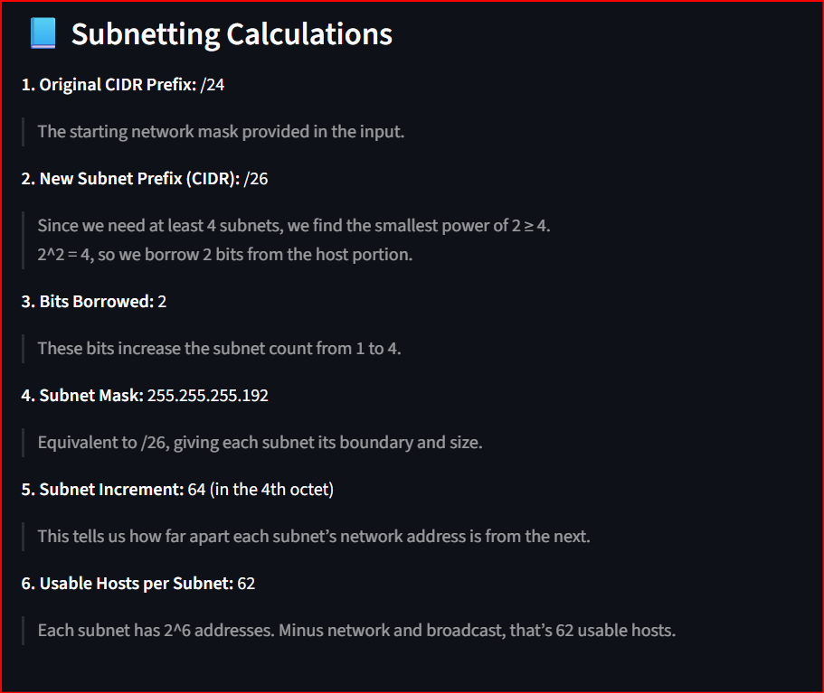
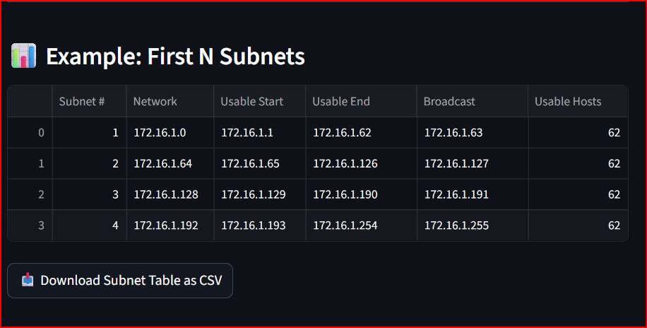

# Advanced Subnet Calculator with Full Explanation


A Streamlit-based subnet calculator that not only computes subnets, but also explains each step in detail.

---

## Overview

A powerful, interactive **Subnet Calculator** built with Streamlit.  
It not only computes subnets — it **teaches the logic behind every step**.

Enter a base network and the number of subnets you need, and the app instantly generates:

- New CIDR prefix  
- Subnet mask  
- Bits borrowed  
- Subnet increments  
- Usable hosts per subnet  
- A full subnet table  
- CSV export  

Perfect for networking students, lab work, CCNA prep, and real‑world subnetting tasks.

---

## Features

- ✔️ Instant subnet calculations  
- ✔️ Step‑by‑step explanations (CIDR, mask, increments, host counts)  
- ✔️ Auto‑generated subnet tables  
- ✔️ Downloadable CSV output  
- ✔️ Clean, responsive Streamlit UI  
- ✔️ Supports any valid IPv4 network  
- ✔️ Great for learning & professional use  

---

## How It Works

### 1. Input
You provide:
- A base network (e.g., `101.0.0.0/8`)
- Number of subnets (e.g., `8`)

### 2. Calculation Logic

- **Original Prefix:**    - /8  

- **Required Subnets:**    - 8 → 2^3 = 8  

- **Bits Borrowed:**    - 3  

- **New Prefix:**    - /11  

- **Subnet Mask:**    - 255.224.0.0  

- **Subnet Increment:**    - 32 (in 2nd octet)  

- **Usable Hosts:**    - 2^21 - 2 = 2,097,150  


### 3. Subnet Diagram

- **101.0.0.0/11**
  - Subnet 0 → 101.0.0.0 - 101.31.255.255  
  - Subnet 1 → 101.32.0.0 - 101.63.255.255  
  - Subnet 2 → 101.64.0.0 - 101.95.255.255  
  - Subnet 3 → 101.96.0.0 - 101.127.255.255  
  - Subnet 4 → 101.128.0.0 - 101.159.255.255  
  - Subnet 5 → 101.160.0.0 - 101.191.255.255  
  - Subnet 6 → 101.192.0.0 - 101.223.255.255  
  - Subnet 7 → 101.224.0.0 - 101.255.255.255  

---

## Installation

This app runs directly on Streamlit Cloud.

You can open it here:
https://ronak-s-ip-wizard-7kdh5fyk7vhruqouvmgnmh.streamlit.app/

If you want to run it locally instead:

### 1. Clone the repository
```bash
git clone https://github.com/yourusername/subnet-calculator.git
cd subnet-calculator
```

### 2. Install dependencies
```bash
pip install -r requirements.txt
```

### 3. Run the app
```bash
streamlit run advanced_subnet_tool.py
```
---

### Usage
Enter a valid IPv4 network (for example: 192.168.0.0/24).

Choose how many subnets you want to create.

The app will automatically display:

- CIDR calculations

- Subnet mask

- Bits borrowed

- Subnet increments

- Usable hosts

- Network ranges

- Broadcast addresses

- Full subnet table

- CSV export option

You can use the app online here:
https://ronak-s-ip-wizard-7kdh5fyk7vhruqouvmgnmh.streamlit.app/

---

## Screenshots

### 1. Input Fields
&nbsp;&nbsp;&nbsp;&nbsp;&nbsp;

### 2. Subnetting Calculations
&nbsp;&nbsp;&nbsp;&nbsp;&nbsp;

### 3. Subnet Table Output
&nbsp;&nbsp;&nbsp;&nbsp;&nbsp;

---

### License
This project is licensed under the MIT License.
See the [LICENSE](./LICENSE) file for full details.

---
